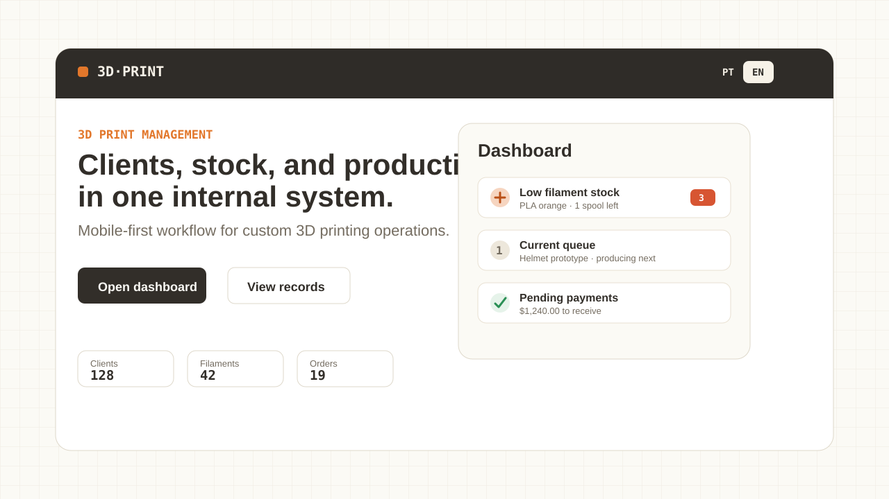
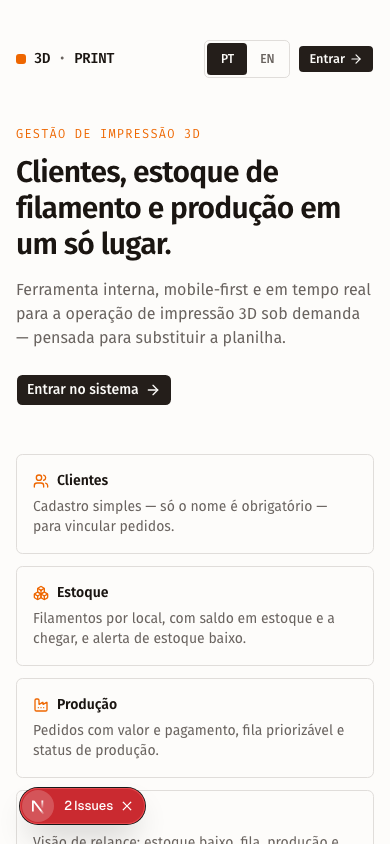
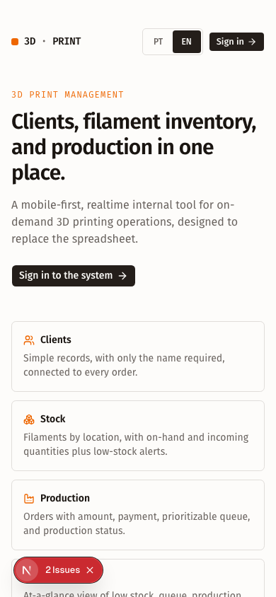
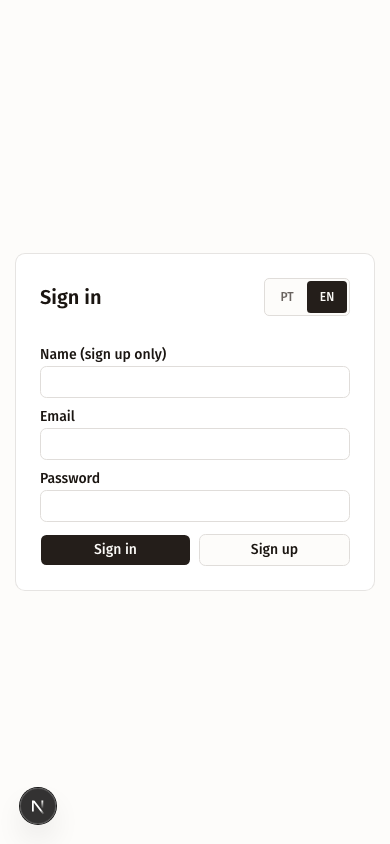
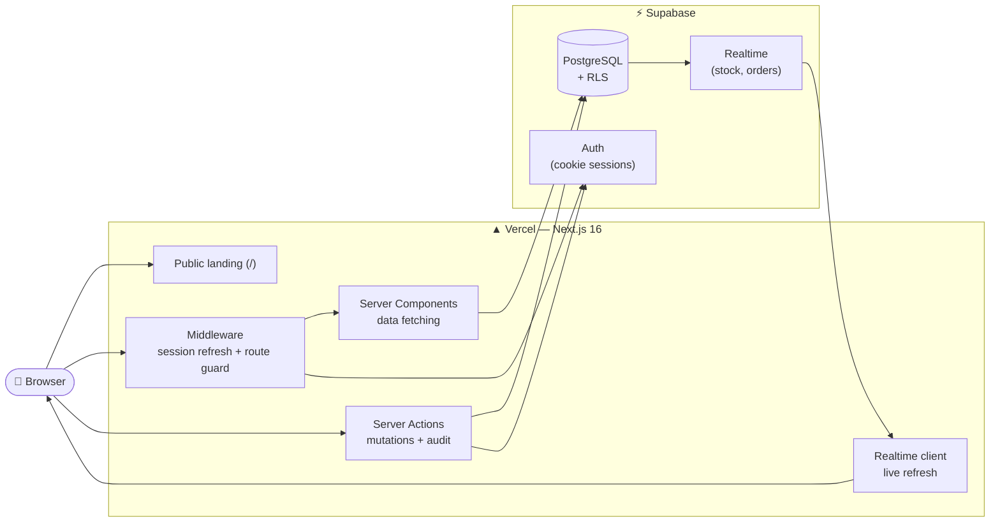
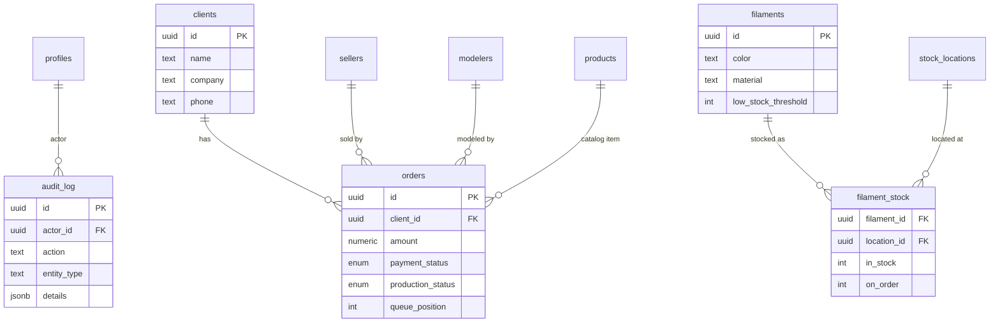

<div align="center">

# 🖨️ 3D Print — Management System

**A real-time, mobile-first management app for an on-demand 3D printing studio — clients, filament stock, and production in one place.**

[](https://nextjs.org/)
[](https://react.dev/)
[](https://www.typescriptlang.org/)
[](https://supabase.com/)
[](https://tailwindcss.com/)
[](https://bun.sh/)
[](https://vercel.com/)
[](./LICENSE)



[**Live Demo**](#) · [**Architecture**](./docs/ARCHITECTURE.md) · [**Product PRD**](./docs/prd/001-gestao-impressao-3d.md)

</div>

---

## Overview

A small studio that does **on-demand 3D modeling and printing** used to run on a spreadsheet and a lot of *"how much filament do you have over there?"*. This app replaces that: a single tool the team opens **on their phones**, updated by everyone and synced in **real time**.

It covers the two core flows of the business — **filament stock control** and **demand management (quotes → production)** — plus a visual dashboard and a full audit log.

> [!NOTE]
> Despite "SaaS" in the name, the scope is a **closed, single-tenant product**: an internal app for **one** company. It is a **system of record** operated only by the business owners — the end customer never logs in. There is no multi-tenancy, no plans, and no billing. Every user is an administrator (no RBAC) — simplicity is intentional.

**Status:** actively developed. Login, dashboard, registries (clients, products, filaments, locations, users), orders with a drag-and-drop priority queue, and an audit log are all in place. Full product scope in the [PRD](./docs/prd/001-gestao-impressao-3d.md).

---

## ✨ Features

| Domain | What it does |
| --- | --- |
| 👥 **Clients** | Lightweight registry (only the name is required) to attach orders to. Search and inline create from the order form. |
| 🧵 **Filament stock** | Per-location stock, tracking rolls **in stock** and **on order**. One-tap increment/decrement, configurable low-stock threshold per filament, and live updates across devices. |
| 🏭 **Production** | Quotes/orders with amount and payment status, a **drag-and-drop priority queue** (`@dnd-kit`), and production status (waiting / producing / done). |
| 📊 **Dashboard** | At-a-glance view: low stock, current queue, work in production, and pending payments. |
| 🗂️ **Registries** | CRUD for clients, products, filaments, stock locations, sellers/modelers, and system users. |
| 📝 **Audit log** | A single timeline of every important action — create, edit, status change, priority change, stock movement, payment — with author and timestamp. |
| 📱 **Mobile-first** | Built for a phone in hand on the shop floor: fixed bottom navigation, touch-friendly controls, responsive layout. |
| ⚡ **Realtime** | Supabase Realtime keeps stock and orders in sync, so nobody works off a stale number. |

The root (`/`) is a public landing page with the product vision and a **Sign in** button; all operational screens sit behind authentication. The entry experience is bilingual (**Brazilian Portuguese** and **English**) through a persistent language switcher.

### Resumo em português

Sistema interno, single-tenant, para uma operação de modelagem e impressão 3D sob demanda. Ele centraliza clientes, catálogo de produtos, estoque de filamento, pedidos, prioridade da fila, status de pagamento e histórico de auditoria em uma aplicação web mobile-first.

Apesar do nome, não é uma plataforma SaaS pública: apenas as pessoas do negócio acessam, todas como administradoras. A interface de entrada já suporta **PT-BR/EN**.

---

## 📸 Screenshots

| Landing PT-BR | Landing EN | Login EN |
| --- | --- | --- |
|  |  |  |

---

## 🧱 Tech Stack

| Layer | Technology |
| --- | --- |
| **Framework / Web** | [Next.js 16](https://nextjs.org/) (App Router) · React 19 · TypeScript (strict) |
| **UI / Styling** | Tailwind CSS v4 · [shadcn](https://ui.shadcn.com/) components on `@base-ui/react` · `lucide-react` icons · `sonner` toasts |
| **Backend / Data** | [Supabase](https://supabase.com/) — PostgreSQL with Auth, Row-Level Security, and Realtime |
| **Forms / Validation** | React Hook Form + Zod (`@hookform/resolvers`) — schema as the single source of truth |
| **Interactions** | `@dnd-kit` for the drag-and-drop demand queue |
| **Runtime / Tooling** | [Bun](https://bun.sh/) (package manager + test runner) |
| **Deploy** | [Vercel](https://vercel.com/) (app) + Supabase Cloud (database) |

---

## 🏗️ Architecture

Next.js App Router with mutations through **Server Actions**, data and auth in **Supabase**, and live UI via **Realtime**. Full write-up in [`docs/ARCHITECTURE.md`](./docs/ARCHITECTURE.md).



**Key decisions**

- **Server Actions for every mutation** — forms validate on the client with Zod and **re-validate on the server with the same schema** (the server is the trust boundary).
- **RLS without RBAC** — any authenticated user has full access; anonymous users get nothing. The ~3 business owners are all admins by design.
- **Pure domain logic in `src/lib/*.ts`** (e.g. queue reordering in `queue.ts`) — I/O-free and unit-tested with `bun test`, separate from the React/Supabase shells.
- **Single audit log** — one server-side helper records every important action instead of scattered history tables.

---

## 🗃️ Data Model



The full schema (tables, RLS, indexes, Realtime publication) lives in [`supabase/migrations/`](./supabase/migrations).

---

## 🚀 Getting Started

**Prerequisite:** [Bun](https://bun.sh) (`curl -fsSL https://bun.sh/install | bash`).

```bash
bun install      # install dependencies
bun run dev      # development server → http://localhost:3000
bun run build    # production build
bun test         # run the test suite
bunx tsc --noEmit  # typecheck (there is no separate lint script)
```

> Use **Bun** as the package manager and runtime — not `npm`/`yarn`/`pnpm`. The lockfile is `bun.lock`.

### Environment variables

Copy `.env.local.example` to `.env.local` (untracked) and fill in your Supabase keys. Never commit secrets.

```bash
NEXT_PUBLIC_SUPABASE_URL=               # Supabase project URL
NEXT_PUBLIC_SUPABASE_PUBLISHABLE_KEY=   # public (browser) key — sb_publishable_…
SUPABASE_SERVICE_ROLE_KEY=              # secret key — SERVER ONLY
```

> The secret key (`service_role` / `sb_secret_…`) is used only on the server (e.g. creating system users). Never expose it to the client.

### Database

The schema lives in [`supabase/migrations/`](./supabase/migrations) (tables, RLS, indexes, Realtime). Apply the migrations to your Supabase project before running the app:

```bash
bunx supabase db push          # apply migrations to a linked project
# or, for local development:
bunx supabase start            # spin up a local Postgres + Studio
bunx supabase db reset         # re-apply all migrations from scratch
```

---

## ☁️ Deployment

The app runs on **Vercel** with a **Supabase Cloud** database.

1. **Supabase** — create a project, then apply the migrations (`bunx supabase link --project-ref <ref>` followed by `bunx supabase db push`). Grab the project URL, the publishable key, and the service-role key from *Project Settings → API*.
2. **Vercel** — import the GitHub repo, set the framework to **Next.js**, and add the three environment variables above (`SUPABASE_SERVICE_ROLE_KEY` as a server-only/secret env var). Vercel auto-detects the build.
3. **Push to deploy** — every push to `main` ships to production; pull requests get preview URLs automatically.

> The middleware refreshes Supabase sessions on every request and guards authenticated routes, so it works the same on Vercel as it does locally.

---

## 📁 Project Structure

```
.
├── src/
│   ├── app/
│   │   ├── page.tsx          # public landing (/) with a sign-in button
│   │   ├── (auth)/login/     # authentication (sign in / sign up via Supabase)
│   │   └── (app)/            # authenticated area (layout redirects to /login)
│   │       ├── dashboard/    # at-a-glance overview
│   │       ├── pedidos/      # orders / quotes
│   │       ├── fila/         # drag-and-drop priority queue (@dnd-kit)
│   │       ├── cadastros/    # registries: clients, products, filaments, locations, users
│   │       └── auditoria/    # audit log
│   ├── components/           # shared UI (ui/, bottom-nav, combobox, realtime-refresh…)
│   └── lib/                  # domain logic (orders, filaments, clients, queue, audit…) + supabase/
├── supabase/migrations/      # schema, RLS, indexes, Realtime
├── docs/                     # PRDs, SPECs, architecture, conventions, QA plans
├── .agents/                  # reusable skills for AI coding agents
├── AGENTS.md                 # conventions for AI agents
├── CLAUDE.md                 # Claude Code–specific guide
├── LICENSE                   # MIT
└── README.md                 # this file
```

> Route folder names (`pedidos`, `fila`, `cadastros`, `auditoria`) are kept in Portuguese because the running app's UI is in Portuguese for a Brazilian business. Code identifiers and docs are in English.

---

## 🧪 Testing & Quality

- **TDD** — domain logic is written test-first. Pure functions in `src/lib/*.ts` each have a co-located `*.test.ts` (run with `bun test`).
- **Strict TypeScript** — `strict: true`, `noUncheckedIndexedAccess`, and no implicit `any`. Typecheck with `bunx tsc --noEmit`.
- **Validation at the boundary** — Zod schemas are re-validated inside Server Actions, never trusting the client.

---

## 📚 Documentation

| Doc | What's inside |
| --- | --- |
| [Architecture](./docs/ARCHITECTURE.md) | System design, request flow, data model, and key decisions |
| [Product PRD](./docs/prd/001-gestao-impressao-3d.md) | Problem, solution, user stories, product decisions |
| [Foundation SPEC](./docs/specs/2026-06-04-fundacao.md) | Bootstrap + auth + schema + audit log implementation plan |
| [Forms convention](./docs/conventions/forms.md) | The canonical React Hook Form + Zod pattern |
| [QA test plans](./docs/qa/) | Mobile-responsive QA plan, lean checklist, and execution results |
| [AGENTS.md](./AGENTS.md) · [CLAUDE.md](./CLAUDE.md) | Conventions for AI coding agents |

---

## 🗺️ Roadmap

- [ ] Automatic stock deduction on print (stock ↔ production integration — v2)
- [ ] Filament cost estimation per order
- [ ] Reports and exports beyond the visual dashboard
- [ ] Push / email notifications for low stock

---

## 📜 License

[MIT](./LICENSE) © 2026 [Thiago Marinho](https://github.com/tgmarinho)
