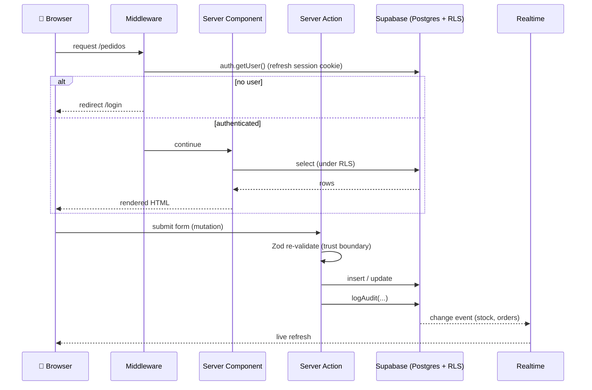
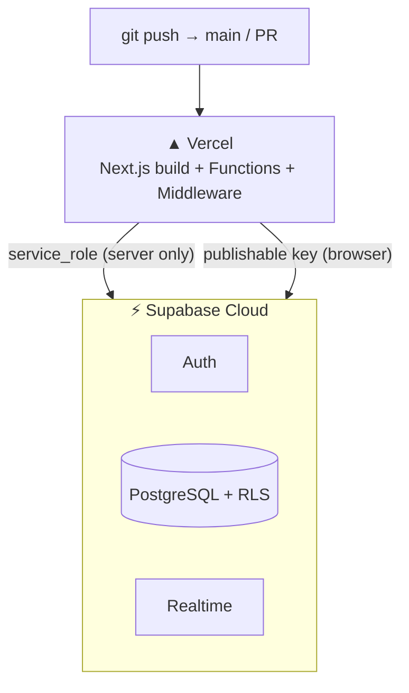

# Architecture

How the **3D Print Management System** is built, why it is shaped this way, and where each responsibility lives. For product scope (the *what* and *why*), see the [PRD](./prd/001-gestao-impressao-3d.md); for build conventions, see [`AGENTS.md`](../AGENTS.md).

## At a glance

A single-tenant, mobile-first web app:

- **Next.js 16 (App Router)** on **Vercel** — Server Components for reads, **Server Actions** for writes, middleware for sessions.
- **Supabase** — PostgreSQL with **Auth**, **Row-Level Security (RLS)**, and **Realtime**.
- **Pure domain logic** in `src/lib/*.ts`, I/O-free and unit-tested, kept separate from the React/Supabase shells.

The end customer never logs in. The ~3 business owners are the only users, all administrators (no RBAC) — a deliberate simplification documented in the PRD.

## Request flow

Two write paths exist deliberately:

- **`<form action={…}>` with `FormData`** for trivial flows (login/signup), where rich validation is not needed.
- **Typed object → Server Action** for everything with real business rules: React Hook Form + Zod give instant client feedback, and the action **re-validates with the same Zod schema** before touching the database.

## Layers and responsibilities

| Layer | Where | Responsibility |
| --- | --- | --- |
| **Routing & rendering** | `src/app/**` | App Router segments. `(auth)` for login, `(app)` for the authenticated shell, `page.tsx` for the public landing. |
| **Session & route guard** | `src/middleware.ts` → `src/lib/supabase/middleware.ts` | Refreshes the Supabase session on every request; redirects unauthenticated users to `/login` and authenticated users away from it. |
| **Mutations** | `actions.ts` per route | Server Actions: validate, write, audit, `revalidatePath`. |
| **Domain logic** | `src/lib/*.ts` | Pure, testable functions (orders, filaments, clients, queue, audit). Each has a co-located `*.test.ts`. |
| **Supabase access** | `src/lib/supabase/` | `server.ts` (RSC/Server Actions), `client.ts` (browser), `middleware.ts` (session), `admin.ts` (service role — server only), `realtime.ts`. |
| **UI** | `src/components/**` | shadcn components on `@base-ui/react`, the mobile bottom nav, combobox, and `realtime-refresh` client wrapper. |
| **Schema** | `supabase/migrations/**` | Tables, RLS policies, indexes, and the Realtime publication. |

### Why pure domain logic is separate

The demand-queue reordering in [`src/lib/queue.ts`](../src/lib/queue.ts) is a good example: `moveItem`, `moveToFront`, `moveToEnd`, and `positionsToUpdate` are pure array functions with no browser or database dependency. The drag-and-drop client composes them for the UI, and the Server Action uses `positionsToUpdate` to persist **only the rows that changed** (recording the move as a `priority` action in the audit log). Because the logic is I/O-free, it is fully unit-tested with `bun test` — no DOM, no Supabase, no mocks.

## Data model

The complete schema is in [`supabase/migrations/`](../supabase/migrations). Highlights:

- **`profiles`** — 1:1 with `auth.users`, created automatically by a `handle_new_user` trigger. All users are administrators.
- **`clients`, `sellers`, `modelers`** — people who are **data on an order**, not system users.
- **`products`** — a reusable catalog (a product is not owned by a client); an order may instead carry an ad-hoc `product_description`.
- **`filaments` + `filament_stock`** — a filament has a configurable `low_stock_threshold`; stock is tracked per location with `in_stock` and `on_order` roll counts (composite primary key `filament_id, location_id`).
- **`orders`** — links client/seller/modeler/product, with `amount`, `payment_status` (`unpaid`/`paid`), `production_status` (`waiting`/`producing`/`done`), and a reorderable `queue_position`.
- **`audit_log`** — a single timeline: `actor_id`, `action`, `entity_type`, `entity_id`, and a `jsonb` `details` payload.

### Security model (RLS without RBAC)

Every table has Row-Level Security enabled with one policy: **full access for any `authenticated` user, nothing for anonymous**. There are no roles. This matches the product decision that the handful of business owners are all admins. The `service_role` key bypasses RLS and is used **only** on the server (via `src/lib/supabase/admin.ts`), for example when creating system users.

### Realtime

Only the tables that benefit from cross-device sync — `filament_stock` and `orders` — are added to the `supabase_realtime` publication. A client component subscribes and triggers a refresh so a stock update on one phone shows up on another without a manual reload.

## Conventions

- **TypeScript strict**; avoid `any`. Mirror the style of surrounding code.
- **Forms:** React Hook Form + Zod, schema as the source of truth, re-validated on the server. See [`docs/conventions/forms.md`](./conventions/forms.md).
- **Secrets:** `.env.local` only; service keys never reach the client.
- **Testing:** TDD for domain logic; verify with `bunx tsc --noEmit` and `bun test` before completing work.

## Deployment topology

Pushes to `main` deploy to production; pull requests get Vercel preview URLs. Environment variables (`NEXT_PUBLIC_SUPABASE_URL`, `NEXT_PUBLIC_SUPABASE_PUBLISHABLE_KEY`, `SUPABASE_SERVICE_ROLE_KEY`) are configured in the Vercel project, with the service-role key marked server-only.
